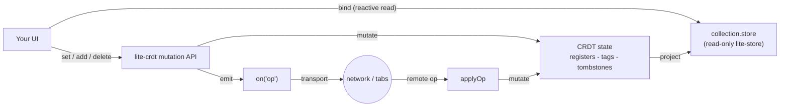
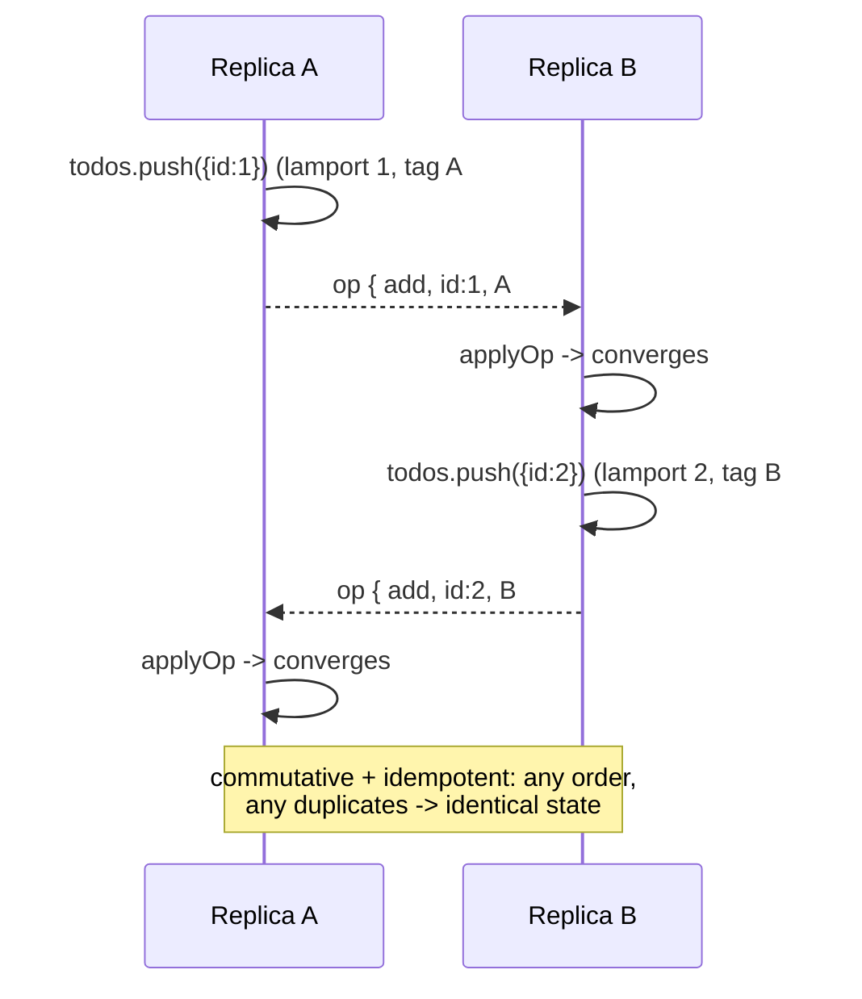

# @zakkster/lite-crdt

[](https://www.npmjs.com/package/@zakkster/lite-crdt)
[](https://github.com/sponsors/PeshoVurtoleta)
[](https://bundlephobia.com/result?p=@zakkster/lite-crdt)
[](https://www.npmjs.com/package/@zakkster/lite-crdt)
[](https://www.npmjs.com/package/@zakkster/lite-crdt)
[](https://github.com/PeshoVurtoleta/lite-signal)
[](https://github.com/PeshoVurtoleta/lite-store)
[](./CRDT.d.ts)
[](./package.json)
[](./LICENSE)

**Operational CRDTs for [`@zakkster/lite-store`](https://www.npmjs.com/package/@zakkster/lite-store).** Make any collection collaborative in a few lines: a last-write-wins map and an observed-remove set that resolve concurrent edits automatically and propagate to your UI through signals. Transport-agnostic, order-independent, and dependency-free.

```js
import { createCRDTDoc } from "@zakkster/lite-crdt";

const doc = createCRDTDoc({ replicaId: "alice-tab-1" });
const todos = doc.array("todos");      // observed-remove set
const settings = doc.map("settings");  // last-write-wins map

todos.push({ id: "a", text: "buy milk", done: false });  // emits an op
settings.set("theme", "dark");                            // emits an op

doc.on("op", (op) => sendToServer(op));   // you choose the transport
doc.applyOp(opFromAnotherReplica);        // state converges, UI updates
```

---

## Why a projection read-model

An op-based CRDT has to capture the *intent* of a change at the moment it happens: "add element X with tag T", "delete the tags I have observed". `lite-store` is a transparent proxy that only fires signals on write, and you cannot reliably reverse-engineer a causal operation from a signal firing without lossy diffing.

So lite-crdt inverts the relationship. **lite-crdt is the authoritative writer; `lite-store` is a reactive read-model.** You mutate through `.set()` / `.add()` / `.delete()` (which emit ops), and you bind your UI to `collection.store` (a read-only `lite-store` projection that updates as state converges). This is the same separation event-sourced systems use, and it is what makes correct ops possible.



Writing to the projection directly is blocked, because it would update local UI while silently bypassing the CRDT:

```js
settings.set("theme", "dark");   // correct: emits an op, converges everywhere
settings.store.theme = "light";  // throws CRDTError("readonly")
```

## Install

```sh
npm install @zakkster/lite-crdt
```

Peer dependencies (you already have these if you use the ecosystem): `@zakkster/lite-store` and `@zakkster/lite-signal`. lite-crdt itself has zero runtime dependencies.

## The two data types

### `doc.map(name)` -- LWW-Map

A keyed register map. Each key holds the value of the last write under a `(lamport, replicaId)` total order. Deletes are timestamped tombstones that compete with writes, so a delete and a concurrent set resolve deterministically.

```js
const s = doc.map("settings");
s.set("theme", "dark");
s.get("theme");      // "dark"   (reactive)
s.has("theme");      // true     (reactive)
s.delete("theme");
s.keys(); s.values(); s.entries(); s.size;   // reactive aggregates
```

Conflict resolution:

| Concurrent operations on the same key | Winner |
| --- | --- |
| `set` vs `set` | higher lamport; tie broken by higher `replicaId` |
| `set` vs `delete` | higher lamport; tie broken by higher `replicaId` |
| any op re-delivered | no-op (idempotent) |

### `doc.array(name, { identify })` -- OR-Set

An observed-remove set keyed by a stable element id, with a last-write-wins value register per id. This is the practical shape for collaborative lists:

- A fresh `add` mints a globally-unique membership tag. Concurrent add and remove resolve **add-wins** (the canonical OR-Set property).
- Re-adding an id that is already present **edits its value** (last-write-wins) without minting a new tag and without changing its position. Toggling `done` does not send the row to the bottom of the list.
- `delete` removes only the tags the caller has observed, so a concurrent add elsewhere survives.
- Order is deterministic across replicas: by each element's first-add `(lamport, replicaId)`.

```js
const todos = doc.array("todos");          // identify defaults to (v) => v.id
todos.push({ id: "1", text: "milk", done: false });
todos.push({ id: "1", text: "milk", done: true });  // edits in place, no reorder
todos.deleteById("1");
todos.has({ id: "1" }); todos.get("1"); todos.values(); todos.size;

// custom identity when elements have no `id`
const cart = doc.array("cart", { identify: (line) => line.sku });
```

| Concurrent operations on the same id | Result |
| --- | --- |
| `add` (fresh tag) vs `remove` | element survives (add-wins) |
| `add`/edit vs `add`/edit | both tags live; value resolves last-write-wins |
| `remove` of observed tags vs concurrent `add` of a new tag | new tag survives |
| any op re-delivered or reordered | converges to the same state |

### `doc.counter(name)` -- PN-Counter

A Positive-Negative counter: two grow-only per-replica maps (increments `P`, decrements `N`); the value is `sum(P) - sum(N)`. Each op carries a replica's **new cumulative** P (or N) and merges by **max**, so -- like the LWW and OR ops -- a counter op is idempotent and commutative, and needs no Lamport clock. Ideal for votes, likes, reactions and presence counts.

```js
const votes = doc.counter("votes");
votes.inc();        // +1  (default step)
votes.inc(5);       // +5
votes.dec(2);       // -2
votes.value();      // 4   (reactive read inside an effect)
votes.peek();       // 4   (untracked)
```

Concurrent `inc`/`dec` on different replicas always converge: because each replica contributes its own cumulative P and N and the merge is max-per-replica, redelivery double-counts nothing and order never matters.

## Transactions and undo

`doc.transact(fn)` runs a burst of edits and flushes them as **one** op-array payload -- a single `ops` event (one network frame, one `applyOps` on the far side) and a single coalesced `change`. Reactive readers update once.

```js
doc.transact(() => {
    doc.map("m").set("title", "Release notes");
    doc.counter("views").inc();
    doc.array("tags").push({ id: "t1", v: "draft" });
});                                   // -> one 'ops' frame of three ops
doc.on("ops", (ops) => channel.postMessage(ops));   // batched transport
```

Because ops are explicit, the inverse of a **local** edit is captured for free at the mutation site into a bounded ring:

```js
doc.map("m").set("k", "v1");
doc.map("m").set("k", "v2");
doc.undo();   // k === "v1"   (emits a real op -> peers converge)
doc.redo();   // k === "v2"
doc.canUndo(); doc.canRedo(); doc.clearHistory();
```

`undo` / `redo` cover map set/delete, OR-Set add/update/remove and counter inc/dec. They are themselves local edits, so their inverse op is emitted and a peer applying it converges. Ring size is `undoDepth` (default 100; `0` disables history). A fresh edit clears the redo ring.

## Reactivity contract

`collection.store` is a read-only `lite-store` projection. Reads through it (and through the methods below) are reactive inside a `lite-signal` `effect` / `computed` / `watch`.

- **Fine-grained** -- `map.get(key)` and `map.has(key)` re-run only when *that key* changes. Bind individual fields to individual DOM nodes via `map.store`.
- **Coarse** -- `keys()` / `values()` / `entries()` / `size` (map) and `values()` / `has()` / `size` (set) re-run on any change to the collection. Bind whole-list renders to these.
- **Replica-independent order** -- map `keys()` / `values()` / `entries()` / `snapshot()` return keys **sorted**, not in insertion order. Replicas converge on the same pairs but learn them in different orders, so insertion order is not a shared fact; sorting is what lets two peers render the same list in the same sequence and hash a snapshot to the same value. Need a domain order? Carry an explicit field and sort by it.
- **The read-only guard is deep** -- nested objects and arrays reached through `.store` (and through `get()` / `values()` / `entries()`) are wrapped too, so `map.store.cfg.theme = "dark"` throws instead of quietly mutating CRDT state without emitting an op. Nested views are identity-stable (`s.cfg === s.cfg`).

```js
import { effect } from "@zakkster/lite-signal";
effect(() => render(todos.values()));     // re-runs on every local or remote change
effect(() => badge(settings.get("plan"))); // re-runs only when "plan" changes
```

## Transports

The core is transport-agnostic: `on('op')` gives you each locally-generated op to send; `applyOp(op)` ingests a remote one. Ops are plain JSON, commutative, and idempotent, so a transport may reorder and redeliver freely.



**WebSocket / WebRTC / server fan-out:**

```js
doc.on("op", (op) => socket.send(JSON.stringify(op)));
socket.onmessage = (e) => doc.applyOp(JSON.parse(e.data));
```

**Cross-tab (built in, zero-config):** a thin helper over the native `BroadcastChannel`. It broadcasts ops and performs a state handshake so a tab that opens late is hydrated in one payload instead of replaying the whole op log.

```js
import { connectBroadcastChannel } from "@zakkster/lite-crdt";
const conn = connectBroadcastChannel(doc, "my-app-room");
// ... later
conn.dispose();
```

## State sync for late joiners

Replaying an unbounded op log to onboard a new replica does not scale. `getState()` serializes the compacted, converged structure (values, live tags, tombstones, clock) into one JSON payload; `mergeState()` merges it. The merge is idempotent and commutative, so it composes with the live op stream.

```js
// new client / tab on boot
const state = await fetch("/doc/state").then((r) => r.json());
doc.mergeState(state);          // hydrated in one shot
doc.on("op", sendToServer);     // then stream live ops
```

## API reference

```text
createCRDTDoc({ replicaId?, clock?, onError?, undoDepth? }) -> doc

doc.replicaId                string
doc.clock()                  number                      current Lamport time
doc.map(name)                -> LWWMap                    cached by name
doc.array(name, opts?)       -> ORSet                     opts.identify?: (v) => string|number
doc.counter(name)            -> PNCounter                 cached by name
doc.transact(fn)             -> fn's return               buffer ops -> one 'ops' frame + one change
doc.undo() / doc.redo()      boolean                      invert the last local edit (emits an op)
doc.canUndo() / doc.canRedo()  boolean
doc.clearHistory()           void
doc.applyOp(op)              void                         apply a remote op (idempotent, no echo)
doc.applyOps(ops)            void
doc.getState() / doc.mergeState(state)                    full-state sync
doc.on('op',  cb) -> off                                  locally-generated ops, one per op
doc.on('ops', cb) -> off                                  batched: one call per transaction (or [op])
doc.on('change', cb) -> off                               any convergent change (local or remote)
doc.snapshot()               object                       plain deep copy of every collection
doc.dispose()                void

LWWMap   get(k) has(k) keys() values() entries() size  (reactive)
         set(k,v) delete(k)                             (emit op)
         store  snapshot()

ORSet    has(v) hasId(id) get(id) values() ids() size   (reactive)
         add(v) / push(v) delete(v) deleteById(id)       (emit op)
         store  snapshot()

PNCounter  value() peek() size                          (reactive value)
           inc(by=1) dec(by=1)                           (emit op)
           snapshot()

connectBroadcastChannel(doc, channelName) -> { dispose() }
CRDTError   { code: 'kind_mismatch' | 'malformed_op' | 'readonly' | 'misconfigured' }
```

## Values are immutable

Stored values are held by reference locally (no defensive clone on the hot path), while remote replicas receive JSON copies over the wire. Treat values as immutable: to change a row, pass a new object to `push`/`set` rather than mutating the one you stored. Mutating a stored object in place would change local state without emitting an op, diverging from every other replica.

## Performance

Run `npm run bench`. Indicative figures on Node 22: LWW-Map writes and applies clear a few million ops/second; OR-Set add/edit/apply run in the hundreds of thousands at a thousand-element list; a 4k-entry `getState`/`mergeState` round trip is a few milliseconds. Op application is allocation-light on the hot path. Incremental OR-Set add/edit touches the ordered projection at O(n) in list length (a single array splice plus a positional scan), which is the right trade for the tens-to-low-thousands sizes CRDTs are used at; bulk-loading a large document is the job of `mergeState`, which rebuilds the projection once rather than per element.

## Out of scope for v1

- **RGA / positional sequences and reorder.** Ordering is by causal timestamp, not by index; there is no convergent "move item to position k" or character-level text. That is an order of magnitude more code and is planned for v2.
- **Tombstone garbage collection.** LWW-Map tombstones and OR-Set removed-tags accumulate. Vector-clock-based compaction is a v2 concern.
- **Rich text and nested-document CRDTs.**

## License

MIT (c) Zahary Shinikchiev
