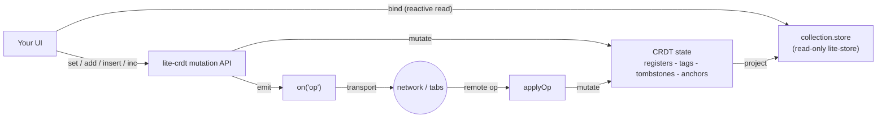

# @zakkster/lite-crdt

> Operational CRDTs for `@zakkster/lite-store`. A last-write-wins map, an observed-remove set, a PN-counter, and an RGA positional list -- four convergent collections whose merged state projects into a reactive lite-store. Op-based, transport-agnostic, order-independent and duplicate-tolerant, with full-state sync and an optional zero-config cross-tab transport. Single-file ESM, zero runtime dependencies.

[](https://www.npmjs.com/package/@zakkster/lite-crdt)
[](https://github.com/sponsors/PeshoVurtoleta)
[](https://bundlephobia.com/result?p=@zakkster/lite-crdt)
[](https://www.npmjs.com/package/@zakkster/lite-crdt)
[](./CRDT.d.ts)
[](./package.json)
[](./LICENSE)

## The convergence layer the ecosystem was missing

`lite-store` gives you a reactive proxy; `lite-signal` gives you the graph under it. Neither one makes a collection *collaborative* -- for that you need convergent replicated data types, and you need them to project back into the same reactive store your UI already binds to. `lite-crdt` is that piece: it owns the authoritative mutation API, resolves concurrent edits by construction, and streams the result into a read-only `lite-store` view. Make any list, map, counter or ordered sequence multiplayer in a few lines.

```sh
npm install @zakkster/lite-crdt
```

Peer dependencies (you already have these if you use the ecosystem): `@zakkster/lite-store` and `@zakkster/lite-signal`. lite-crdt itself has zero runtime dependencies.

```js
import { createCRDTDoc } from "@zakkster/lite-crdt";

const doc = createCRDTDoc({ replicaId: "alice-tab-1" });
const settings = doc.map("settings");    // last-write-wins map
const todos    = doc.array("todos");     // observed-remove set
const votes    = doc.counter("votes");   // PN-counter
const steps    = doc.list("steps");      // RGA positional sequence

settings.set("theme", "dark");                            // emits an op
todos.push({ id: "a", text: "buy milk", done: false });   // emits an op
votes.inc();                                              // emits an op
steps.insert(0, "preheat oven");                          // emits an op

doc.on("op", (op) => sendToServer(op));   // you choose the transport
doc.applyOp(opFromAnotherReplica);        // state converges, UI updates
```

Every op is plain JSON, commutative and idempotent, so a transport may reorder and redeliver freely; the four collections converge to identical state on every replica regardless of arrival order.

---

## Table of contents

- [Why this exists](#why-this-exists)
- [What you get](#what-you-get)
- [The four collections](#the-four-collections)
- [API reference](#api-reference)
  - [Document](#document)
  - [Collections](#collections)
  - [Constants and errors](#constants-and-errors)
- [Composability with the ecosystem](#composability-with-the-ecosystem)
- [Zero-GC design notes](#zero-gc-design-notes)
- [Design decisions worth knowing](#design-decisions-worth-knowing)
- [Testing](#testing)
- [What this is not](#what-this-is-not)
- [Ecosystem](#ecosystem)

---

## Why this exists

An op-based CRDT has to capture the *intent* of a change at the moment it happens: "add element X with tag T", "delete the tags I have observed", "insert after anchor A". `lite-store` is a transparent proxy that only fires signals on write, and you cannot reliably reverse-engineer a causal operation from a signal firing without lossy diffing.

So lite-crdt inverts the relationship. **lite-crdt is the authoritative writer; `lite-store` is a reactive read-model.** You mutate through `.set()` / `.add()` / `.insert()` / `.inc()` (which emit ops), and you bind your UI to `collection.store` -- a read-only `lite-store` projection that updates as state converges. This is the same separation event-sourced systems use, and it is what makes correct ops possible.



Writing to the projection directly is blocked, because it would update local UI while silently bypassing the CRDT:

```js
settings.set("theme", "dark");   // correct: emits an op, converges everywhere
settings.store.theme = "light";  // throws CRDTError("readonly")
```

The alternatives are a heavyweight framework (Yjs / Automerge, each its own runtime and bundle) or rolling your own merge logic (weeks, and it drifts). lite-crdt is the small, dependency-free layer for exactly this job.

---

## What you get

- **`doc.map(name)` -- LWW-Map.** A keyed register map; each key holds the value of the last write under a `(lamport, replicaId)` total order. Deletes are timestamped tombstones that compete with writes.
- **`doc.array(name, { identify })` -- OR-Set.** An observed-remove set keyed by a stable id with a last-write-wins value register per id -- the practical shape for collaborative lists. Concurrent add/remove resolve add-wins; re-adding a present id edits its value without reordering.
- **`doc.counter(name)` -- PN-Counter.** Per-replica cumulative increments and decrements, merged by max. Idempotent and commutative with no Lamport clock. Votes, likes, presence.
- **`doc.list(name)` -- RGA positional sequence** *(new in 2.0)*. An ordered list with first-class `insert`, `delete` and **`move`**. Element identity is an immutable birth anchor; MOVE is a convergent LWW position register (not delete+reinsert), so concurrent moves of one element converge to one winner and move-vs-delete commute.
- **Transactions, undo/redo, full-state sync, delta sync, tombstone compaction, and an optional cross-tab BroadcastChannel transport** -- all sharing one Lamport clock and version vector per doc.

Full types ship in [`CRDT.d.ts`](./CRDT.d.ts). Every export is documented.

---

## The four collections

<details>
<summary>What each collection does, its conflict resolution, and when to reach for it.</summary>

### `doc.map(name)` -- LWW-Map

```js
const s = doc.map("settings");
s.set("theme", "dark");
s.get("theme");      // "dark"   (reactive)
s.has("theme");      // true     (reactive)
s.delete("theme");
s.keys(); s.values(); s.entries(); s.size;   // reactive aggregates
```

| Concurrent operations on the same key | Winner |
| --- | --- |
| `set` vs `set` | higher lamport; tie broken by higher `replicaId` |
| `set` vs `delete` | higher lamport; tie broken by higher `replicaId` |
| any op re-delivered | no-op (idempotent) |

### `doc.array(name, { identify })` -- OR-Set

- A fresh `add` mints a globally-unique membership tag. Concurrent add and remove resolve **add-wins** (the canonical OR-Set property).
- Re-adding an id that is already present **edits its value** (last-write-wins) without minting a new tag and without changing its position. Toggling `done` does not send the row to the bottom of the list.
- `delete` removes only the tags the caller has observed, so a concurrent add elsewhere survives.
- Order is deterministic across replicas: by each element's first-add `(lamport, replicaId)`.

```js
const todos = doc.array("todos");          // identify defaults to (v) => v.id
todos.push({ id: "1", text: "milk", done: false });
todos.push({ id: "1", text: "milk", done: true });  // edits in place, no reorder
todos.deleteById("1");
const cart = doc.array("cart", { identify: (line) => line.sku });  // custom identity
```

| Concurrent operations on the same id | Result |
| --- | --- |
| `add` (fresh tag) vs `remove` | element survives (add-wins) |
| `add`/edit vs `add`/edit | both tags live; value resolves last-write-wins |
| `remove` of observed tags vs concurrent `add` of a new tag | new tag survives |
| any op re-delivered or reordered | converges to the same state |

### `doc.counter(name)` -- PN-Counter

Two grow-only per-replica maps (increments `P`, decrements `N`); value is `sum(P) - sum(N)`. Each op carries a replica's **new cumulative** P (or N) and merges by **max**, so a counter op is idempotent and commutative and needs no Lamport clock.

```js
const votes = doc.counter("votes");
votes.inc();  votes.inc(5);  votes.dec(2);
votes.value();   // 4 (reactive inside an effect)   votes.peek();  // 4 (untracked)
```

### `doc.list(name)` -- RGA positional sequence

An RGA (Replicated Growable Array): an ordered list where every element has an immutable **birth anchor** `(l, r)` and a position fixed at integration by the RGA scan (concurrent same-origin inserts descend by `(lamport, replicaId)`), so order is deterministic and replica-independent.

```js
const steps = doc.list("steps");
const id = steps.insert(0, "preheat oven");   // -> birth id "alice-tab-1#1"
steps.insert(1, "mix batter");
steps.move(1, 0);            // move "mix batter" to the front
steps.delete(0);            // delete the element now at index 0
steps.deleteById(1, "alice-tab-1");   // delete by birth anchor
steps.values();  steps.ids();  steps.size;   // reactive reads (ids are stable across moves)
```

- **Delete** is a monotone flag: once deleted, an element is never resurrected; its birth anchor stays linked so a concurrent insert that named it as an origin still lands.
- **Move** is a first-class LWW position register whose value is a freshly minted anchor id -- *not* delete+reinsert, *not* a live-element pointer. Two concurrent moves of one element converge to one winner; move and delete **commute** (they write disjoint fields).
- An out-of-order frame (an insert/move whose origin, or a delete/move whose birth, has not arrived) **pends** in a capped, fail-closed buffer and is reconciled when its dependency integrates -- it is never dropped.

| Concurrent operations | Result |
| --- | --- |
| two `insert`s after the same anchor | ordered by `(lamport, replicaId)` descending, deterministic |
| two `move`s of one element | one winner (higher stamp); the loser's anchor is abandoned |
| `move` vs `delete` of one element | deleted on every replica (commute, disjoint fields) |
| any op re-delivered or reordered | converges to the same sequence |

</details>

---

## API reference

### Document

```text
createCRDTDoc({ replicaId?, clock?, onError?, undoDepth? }) -> doc

doc.replicaId                string
doc.clock()                  number                      current Lamport time
doc.map(name)                -> LWWMap                    cached by name
doc.array(name, opts?)       -> ORSet                     opts.identify?: (v) => string|number
doc.counter(name)            -> PNCounter                 cached by name
doc.list(name)               -> RGAList                   cached by name
doc.transact(fn)             -> fn's return               buffer ops -> one 'ops' frame + one change
doc.undo() / doc.redo()      boolean                      invert the last local edit (emits an op)
doc.canUndo() / doc.canRedo()  boolean
doc.clearHistory()           void
doc.applyOp(op)              void                         apply a remote op (idempotent, no echo)
doc.applyOps(ops)            void
doc.getState() / doc.mergeState(state)                    full-state sync
doc.versionVector()          object                       per-writer max Lamport (for delta requests)
doc.getStateSince(V)         DocState                     delta filtered to what a peer at V lacks
doc.compact(V)               number                       reclaim causally-stable tombstones + anchors
doc.on('op' | 'ops' | 'change', cb) -> off
doc.snapshot()               object                       plain deep copy of every collection
doc.dispose()                void
```

### Collections

```text
LWWMap    get(k) has(k) keys() values() entries() size   (reactive)
          set(k,v) delete(k)                             (emit op)
          store  snapshot()

ORSet     has(v) hasId(id) get(id) values() ids() size   (reactive)
          add(v) / push(v) delete(v) deleteById(id)       (emit op)
          store  snapshot()

PNCounter value() peek() size                            (reactive value)
          inc(by=1) dec(by=1)                             (emit op)
          snapshot()

RGAList   values() ids() size                            (reactive)
          insert(index, value) -> "r#l"                   (emit lins)
          delete(index) deleteById(bl, br)                (emit ldel)
          move(fromIndex, toIndex)                        (emit lmv)
          store  snapshot()

connectBroadcastChannel(doc, channelName) -> { dispose() }
```

### Constants and errors

| Wire op | Shape | Meaning |
| --- | --- | --- |
| `set` / `del` | `{ t, c, k, [v], l, r }` | LWW-Map write / timestamped delete |
| `add` / `upd` / `rm` | `{ t, c, id, [n], [v], [g], l, r }` | OR-Set add-tag / value edit / remove observed tags |
| `cinc` / `cdec` | `{ t, c, r, p \| n }` | PN-Counter new cumulative P / N (no `l`) |
| `lins` | `{ t, c, l, r, or, ol, v }` | RGA insert: `(l,r)` birth anchor, `(or,ol)` origin (`or:null` = HEAD) |
| `ldel` | `{ t, c, l, r, bl, br }` | RGA delete of birth `(bl,br)`; `(l,r)` remover stamp |
| `lmv` | `{ t, c, l, r, bl, br, or, ol }` | RGA move of birth `(bl,br)`; `(l,r)` register stamp + minted anchor; `(or,ol)` destination origin |

`CRDTError` codes: `kind_mismatch`, `malformed_op`, `malformed_state`, `readonly`, `misconfigured`. A caller-supplied `replicaId` must be a non-empty string (it stamps every op's `r`); an omitted one is auto-minted from crypto.

---

## Composability with the ecosystem

A collaborative editor, mutation to converged UI, with all four collection kinds and a cross-tab transport:

```js
import { createCRDTDoc, connectBroadcastChannel } from "@zakkster/lite-crdt";
import { effect } from "@zakkster/lite-signal";

const doc = createCRDTDoc({ replicaId: crypto.randomUUID() });
const title = doc.map("meta");        // LWW register map
const tags  = doc.array("tags");      // observed-remove set
const likes = doc.counter("likes");   // PN-counter
const steps = doc.list("recipe");     // RGA ordered sequence

// 1. Cross-tab sync in one line: broadcasts local ops, hydrates a late tab via getState().
const conn = connectBroadcastChannel(doc, "recipe-room");

// 2. Bind the UI to the read-only projections; each re-runs only on relevant change.
effect(() => renderTitle(title.get("name")));
effect(() => renderTags(tags.values()));
effect(() => renderLikes(likes.value()));
effect(() => renderSteps(steps.values()));   // in RGA sequence order

// 3. A burst of edits flushes as ONE op frame and one coalesced UI update.
doc.transact(() => {
    title.set("name", "Focaccia");
    tags.push({ id: "bread" });
    steps.insert(0, "mix flour + water");
    steps.insert(1, "rest 12h");
    steps.move(1, 0);          // reorder converges everywhere
    likes.inc();
});

// 4. Onboard a server-backed replica with delta sync instead of an op-log replay.
doc.on("op", (op) => ws.send(JSON.stringify(op)));
ws.onmessage = (e) => doc.applyOp(JSON.parse(e.data));
const delta = sender.getStateSince(doc.versionVector());   // one frame, only what we lack
doc.mergeState(delta);

// 5. Reclaim tombstones + dead anchors once every replica has acknowledged the frontier.
doc.compact(pointwiseMinVersionVectorAcrossReplicas);
```

Every stage passes plain JSON ops; every collection converges independently under the one shared clock; the read-only `lite-store` projections mean the UI never mutates CRDT state behind the ops' back.

---

## Zero-GC design notes

<details>
<summary>What the receive path allocates (nothing), and how the proofs are gated.</summary>

An op-based CRDT necessarily allocates the op object when it **emits** (the op is the payload). The zero-allocation claim therefore lives on **apply**: receiving a remote op mutates registers, tags, counters and the RGA anchor chain **in place**. Every collection reads all its op fields into stack locals through one pre-allocated doc-owned scratch op before it fires any reactive change, so a reentrant `applyOp` from a `change` listener cannot clobber a field mid-apply, and steady-state apply allocates nothing.

| Apply path | Steady-state allocation |
| --- | --- |
| `set` / `del` (LWW-Map, in place) | **0 B/op** |
| `upd` (OR-Set value register, in place) | **0 B/op** |
| `cinc` / `cdec` (PN-counter max-merge, in place) | **0 B/op** |
| REDELIVERED `lins` / `ldel` / `lmv` (idempotent, byR index short-circuit, no scan) | **0 B/op** |
| First-delivery `lins` (one node + element + index entry + projection slot) | ~242-252 B/op, flat O(1) |
| Local `insert` / `set` / `add` emit (the op object is the payload) | one op per edit (by design) |

The torture harness (`@zakkster/lite-leak` + `@zakkster/lite-gc-profiler`, under `node --expose-gc`) gates the receive path at `maxMajor: 0`, `maxPauseMs: 4`, `maxArrayBuffersGrowth: 0` with `stabilize: 'deep'` over 40000 redelivered applies -- plus a structural check the heap gate cannot make: the list's anchor and element census move by **exactly 0** across the window and the pending buffer stays empty. First-delivery insert is measured separately (surviving ~242-252 B/op: one node + one element + one index entry + one projection slot, proven flat across list length) against a calibrated **320 B/op** regression ceiling, explicitly excluded from the 0-B claim -- it catches a second allocation slipping onto the insert path without pretending an inherently growing structure is free.

Beyond leak-freedom, the harness commits the *convergence* claims as gates, so a merge bug fails CI as loudly as a leak:

- **Differential convergence (T5)** -- an INDEPENDENT reference RGA (array-of-anchors + a birth-keyed element map, re-derived from scratch, no linked list, no pending buffer) drives `24 x SCALE` seeds x 5 replicas x 8 shuffled + duplicated + poison-injected deliveries: **0 divergences** from the oracle and across replays, idempotent under full re-delivery, structurally valid after every replay, poison actually rejected. A flipped integration comparator or a missing move guard is caught here.
- **Retention/compaction soak (T7)** -- 20000-op churn over 64 live ids; after compacting to a quiescent fixpoint the anchor census settles to the confirmed `size + 1 + U` bound (U = still-live moved-element birth homes + origin-referenced anchors, O(live)), while a never-compacted control grows O(ops). The rendered sequence is byte-identical, and replaying the whole log after compaction resurrects nothing.
- **Non-vacuity controls (T9)** -- five deliberately-broken variants (ascending-tie order, move without the win guard, drop-instead-of-pend, unsound anchor unlink, an allocating apply) each fire-and-catch: the gate fails on the broken version or it is not a gate.

</details>

---

## Design decisions worth knowing

- **The projection is read-only and the guard is deep.** Nested objects and arrays reached through `.store` (and through `get()` / `values()` / `entries()`) are wrapped too, so `map.store.cfg.theme = "dark"` throws instead of mutating CRDT state without emitting an op. Nested views are identity-stable (`s.cfg === s.cfg`).
- **Replica-independent order.** Map `keys()`/`values()`/`entries()` return keys **sorted**; OR-Set order is by first-add `(lamport, replicaId)`; RGA order is the causal-tree preorder. Two replicas converge on the same members but learn them in different orders, so a shared, deterministic order is what lets peers render and hash identically. Need a domain order in a map/set? Carry an explicit field and sort by it -- or use `doc.list` when position *is* the data.
- **MOVE is a first-class register, not delete+reinsert (decisions/0006).** An anchor-VALUED LWW position register keeps one identity and one winner under concurrent moves, commutes with delete, and never orphans a concurrent insert that named the element -- the failure modes delete+reinsert and element-relative pointers both hit.
- **Out-of-order is pending, never dropped.** A frame whose causal dependency has not arrived is buffered (capped, fail-closed on overflow), not discarded -- dropping would diverge under reorder. This is what makes "reorder and redeliver freely" true for the list, not just the registers.
- **Compaction is opt-in and fails closed.** `compact(V)` reclaims only causally-stable tombstones; the caller supplies the pointwise-min version vector. RGA anchor UNLINK additionally requires proven global quiescence (`minAck >= max(V) >= clock`) -- the only sound discharge of "no future op names this anchor" from a version vector. A malformed `V` reclaims nothing and reports; it never throws.
- **Fail closed, name the value.** A caller `replicaId` must be a non-empty string; a malformed op or state is dropped and routed to `onError`, never applied, never crashed. `null` is not zero.
- **The 2.0 break is forward-only.** A 1.x replica throws `malformed_op` on any `lins`/`ldel`/`lmv` and drops a `kind:"list"` state; a 2.0 replica is a strict superset. The core-three wire format is proven byte-identical to 1.3.1 by a checked-in golden fixture.

---

## Testing

**367 deterministic tests, all pass**, plus a tiered torture gate that proves both leak-freedom and convergence.

```sh
npm test          # 367 node:test cases (contract + boundary + adversarial + golden fixture)
npm run torture   # @zakkster/lite-leak + lite-gc-profiler: 0 B/op receive path + convergence gates
npm run verify    # test + torture, the publish gate
```

The suites cover the four collections' contracts and conflict resolution, the remote-op door (every malformed-field path dropped + reported), prototype-safe collection/element names, undo/redo, transactions, full-state and delta sync, tombstone compaction, and the RGA list end to end (order, delete, move, born-dead / born-moved reconciliation, serialization, the pinned backward-typing interleaving, and adversarial crafted-state eviction guards). The torture tiers add a differential RGA oracle (T5), the zero-alloc receive gate (T6), a retention/compaction soak (T7), and five non-vacuity controls (T9) -- each control proves its gate can actually fail on a broken input. A golden fixture (`test/fixtures/golden-core-three.json`, captured from a real v1.3.1 build) pins the core-three wire format byte-for-byte, proving the 2.0 RGA work did not drift it. No gate output is a FAIL -- silence never means pass.

---

## What this is not

- **Not a framework.** No components, no router, no server. It is the convergence layer; bring your own UI and transport (`on('op')` out, `applyOp` in).
- **Not a rich-text or nested-document CRDT.** The RGA list converges positional sequences of whole values; character-level collaborative text and deeply nested document trees are out of scope.
- **Not a transport.** Ops are plain JSON you route yourself; a zero-config cross-tab `BroadcastChannel` helper ships, but WebSocket/WebRTC/server fan-out is your wiring.
- **Not automatic garbage collection.** Tombstones and dead anchors accumulate until you call `compact(V)` with a proven frontier -- reclamation is a deliberate, safe act, never a silent background sweep.
- **Not a persistence layer.** `getState()` serializes; where you store the bytes is yours.

---

## Ecosystem

Part of the **@zakkster** zero-GC stack:

- [`lite-signal`](https://www.npmjs.com/package/@zakkster/lite-signal) -- zero-GC reactive graph for hot paths (peer dep)
- [`lite-store`](https://www.npmjs.com/package/@zakkster/lite-store) -- transparent reactive proxy over plain objects/arrays (peer dep, the projection target)
- [`lite-gc-profiler`](https://www.npmjs.com/package/@zakkster/lite-gc-profiler) -- the GC-budget gate the torture harness runs under
- [`lite-leak`](https://www.npmjs.com/package/@zakkster/lite-leak) -- the retention tracker the torture harness runs under
- **`lite-crdt`** -- this package

---

## License

MIT (c) Zahary Shinikchiev <shinikchiev@yahoo.com>
